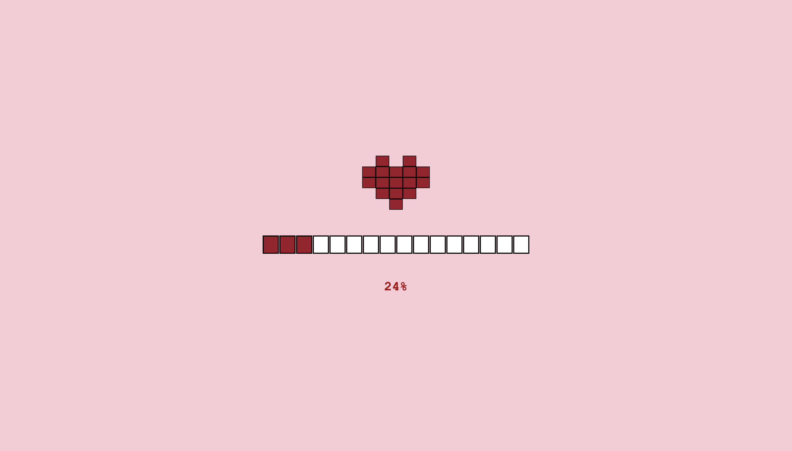
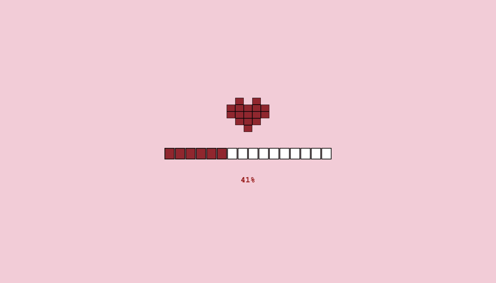
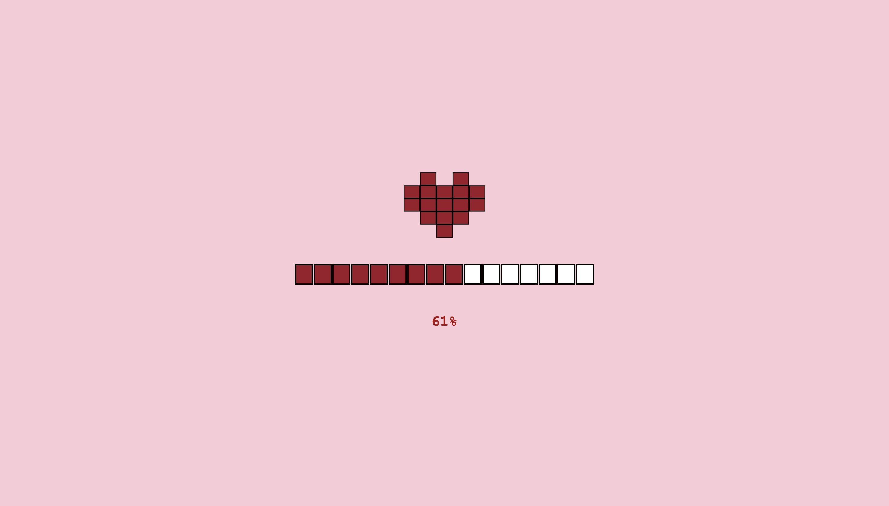

# pixel-heart-loading-animation
A cute pixel-art heart loading animation with a pixelated progress bar, built using HTML, CSS, and JavaScript.
# ❤️ Pixel Heart Loading Animation

A pixel-art style heart loading animation with a pixelated progress bar and percentage counter — perfect for retro-themed websites or games.  
Built using **HTML**, **CSS**, and **JavaScript**.

---

## ✨ Features
- Pixel-perfect heart design  
- Pixelated progress bar with smooth animation  
- Percentage counter updates in real time  
- Heartbeat animation for extra cuteness  
- Fully responsive and retro-styled

---

## 📸 Preview





---

## 🚀 Demo
You can check the live version here:  
[Live Demo](https://github.com/SaniaDebbarma/pixel-heart-loading-animation/tree/main) 

---

## 📂 Installation
Clone the repository and open the `index.html` file in your browser.
```bash
git clone https://github.com/SaniaDebbarma/pixel-heart-loading-animation.git
cd pixel-heart-loading-animation
🛠 Technologies Used
	•	HTML5
	•	CSS3
	•	JavaScript (Vanilla)

⸻

🛠 Technologies Used
	•	HTML5
	•	CSS3
	•	JavaScript (Vanilla)

⸻

📜 Usage
	•	Click anywhere to reset the loading progress to 0%.
	•	Customize heart colors, bar size, and speed in the CSS/JS files.

📄 License

This project is licensed under the MIT License — feel free to use it in your own projects.

⸻

👩‍💻 Author

Sania Debbarma
